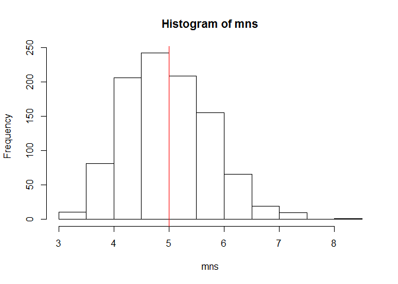

# Statistical inference Course Project

## Initilaize the parameter
We set up all parameters used in this simulation and they should be self-explanatory. 

```r
lambda <- 0.2
expmean <- 1/lambda
expvar <- 1/lambda
n <- 40
times <- 1000
```

## Part 1
Let's start with simulating the average of n=40 exponential random variables and find the corresponding variance

```r
mns <- NULL
for (i in 1:times){
  data <- rexp(n,lambda)
  mns <- c(mns, mean(data))
}
sns <- var(mns)
```
The following is the histogram of the average of n=40 exponential random variables. We can see that it centers at exactly the theoretical mean, which is 5, of the distribution. 

```r
hist(mns)
abline(v=expmean,col="red")
```

 

## Part 2
Here is the variance of the average of n=40 exponential random variables and it is very close to the theoretical variance, which is 25/40=0.625, of the distribtion.

```r
sns
```

```
## [1] 0.6045029
```

## Part 3
To see the distribution is approximately normal, let subtract the average of n=40 exponential random variables by the theoretical mean and then divide by the theoretical variance. We plot the histogram and overlay a standard normal pdf to show it is approximately normally distributed. 

```r
hist((mns-5)/0.625,20,prob=TRUE,ylim=c(0,0.4))
curve(dnorm(x,mean=0,sd=1),col="darkblue", lwd=2, add=TRUE)
```

 


